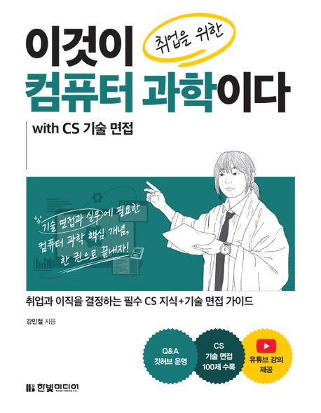
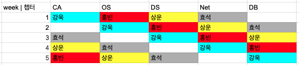

# 이것이 취업을 위한 컴퓨터 과학이다 with CS 기술면접

## 📖 Intro

> [!TIP]
>
> - [이것이 취업을 위한 컴퓨터 과학이다 with CS 기술면접](https://product.kyobobook.co.kr/detail/S000214014967) 교재를 활용한 CS 지식 학습 스터디입니다.
> - 해당 책을 통해 **전반적인 CS 기본 개념을 이해하고 정리하는 시간**을 가집니다.

## 👥 Members

- [이강욱(@iamkanguk97)](https://github.com/iamkanguk97)
- [이상운(@Sangun-Lee-6)](https://github.com/Sangun-Lee-6)
- [백효석(@alexization)](https://github.com/alexization)
- [김홍빈(@vinivin153)](https://github.com/vinivin153)

## 📅 스터디 진행 방식

### 진행 주기

- `기간`: 2026년 1월 13일 ~ 2026년 2월 10월 (총 5주)
- 매주 화요일 오후 5시 30분 ~ 7시
- `장소`: 미정 (사내 회의실 OR 근처 스터디룸)

### 학습 방법

1. 매주 할당된 챕터 전체를 사전에 읽어옵니다.
2. 맡은 챕터의 소챕터들 중 본인이 원하는 부분에 대한 정리를 하고 스터디 당일날 발표합니다. (단, 이전에 다른 스터디원이 정리한 부분은 정리할 수 없습니다)
