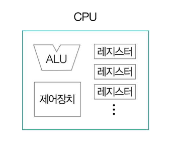

# CPU(Central Processing Unit)

> [!NOTE]
>
> - 컴퓨터가 이해하는 정보에는 크게 데이터와 명령어가 있음.
> - 이러한 정보를 읽어 들익, 해석하고, 실행하는 부품을 CPU라고 한다.

## CPU 내부 구조

- `산술논리연산장치(ALU: Arithmetic Logic Unit)`: 사칙 연산, 논리 연산과 같은 연산을 수행할 회로로 구성되어 있는 계산기.
- `제어장치(CU: Control Unit)`
  - 명령어를 해석해 제어 신호라는 전기 신호를 내보내는 장치.
  - 제어 신호(Control Signal): 부품을 작동시키기 위한 신호
  - CPU가 메모리를 향해 제어 신호를 보내면 메모리를 작동시킬 수 있고, 입출력장치를 통해 제어 신호를 보내면 입출력장치를 작동시킬 수 있다.
- `레지스터(Register)`
  - CPU 내부의 작은 임시 저장장치로, 데이터와 명령어를 처리하는 과정의 중간값을 저장.
  - CPU 내에는 여러 개의 레지스터가 존재하고, 각기 다른 이름과 역할을 가지고 있다.
