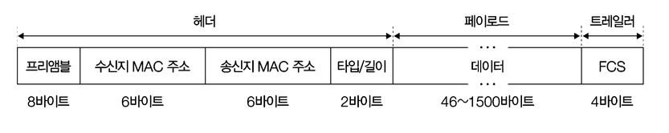

# 이더넷(Ethernet)

> [!IMPORTANT]
>
> - L1 계층과 L2 계층에는 LAN 내의 호스트들이 올바르게 정보를 주고받을 수 있게 해주는 다양한 기술이 있다.
> - 대표적인 기술로는 이더넷이 있다.
> - 이더넷은 통신 매체를 통해 신호를 송수신하는 방법, L2 계층에서 주고받는 프레임 형식 등이 정의된 기술이다.
> - 현대 대부분의 유선 LAN은 이더넷을 기반으로 구현되어 있다.

## 이더넷 표준

> [!IMPORTANT]
>
> - 오늘날의 유선 LAN이 대부분 이더넷 표준을 따르기 때문에 대다수의 LAN 장비들이 특정 이더넷 표준을 따른다.
> - 이더넷 표준이 달라지면 통신 매체의 종류를 비롯한 신호 송수신 방법, 나아가 최대 지원 속도도 달라질 수 있다.

## 이더넷 프레임

> `이더넷 프레임`: 이더넷 기반의 네트워크에서 주고받는 프레임

### 프리앰블(Preamble)

- `송수신지 동기화`를 위해 사용되는 8바이트 크기의 정보
- 첫 7바이트는 `10101010` 이라는 값을 가지고, 마지막 바이트는 `10101011` 이라는 값을 가진다.
- 수신지 입장에서는 이 프리앰블 비트를 통해 현재의 이더넷 프레임이 수신되고 있다는 사실을 알 수 있다.

### 송/수신지 MAC 주소

- `MAC 주소`는 6바이트 길이로 콜론으로 구분된 12자리 16진수로 구성된다.
  - ex. `ab:cd:ab:cd:00:01`
  - `물리적 주소`로, `네트워크 인터페이스`마다 하나씩 부여되는 주소.
    - `네트워크 인터페이스`: 네트워크를 향하는 통로, 연결 매체와의 연결 지점, 보통은 `NIC(Network Interface Card)` 라는 장치가 담당.

### 타입/길이

- 명시된 크기가 `1500 이하`이면 `프레임의 크기`, `1536 이상`이면 `타입`을 나타냄.
- 타입은 **캡슐화된 상위 계층의 정보**를 의미한다.
  - 예를 들어, `IPv4`가 캡슐화된 정보를 운반한다면 타입에는 `Ox0800`이 명시되고, `ARP`라면 `Ox0806`이 명시된다.

### 데이터

- 최대 크기는 일반적으로 `1500 바이트` 이하로 제한되어 있고, 이보다 큰 데이터를 보낼 경우 여러 패킷으로 나뉘어 보내진다.
- 1500 바이트라는 숫자는 `이더넷 프레임으로 전송 가능한 최대 데이터의 크기`이고, `L3 Packet(헤더 + 페이로드)의 최대 크기를 지칭하는데 사용`함.
- 이를 `MTU(Maximum Transmission Unit)`라고 한다.
- 참고로, 데이터 필드에 명시 가능한 최대 페이로드의 크기는 일반적으로 1500 바이트이지만, 더 큰 데이터를 포함할 수 있는 특별한 프레임이 있는데 이를 `점보 프레임(Jumbo Frame)`이라고 한다.

### FCS(Frame Check Sequence)

- 프레임의 오류가 있는지의 여부를 확인하기 위한 필드로, Checksum 역할과 동일하다고 생각하자.
- `CRC(Cyclic Redundancy Check)` 라는 오류 검출용 값이 명시된다.
- **송신지에서 전송할 데이터와 더불어 전송할 데이터에 대한 CRC 값을 계산해서 보내게 되면, 수신지에서는 전달받은 데이터에 대한 CRC 값을 계산해서 그 값을 전달받은 CRC 값과 대조해서 프레임에 오류가 있는지 확인한다.**
