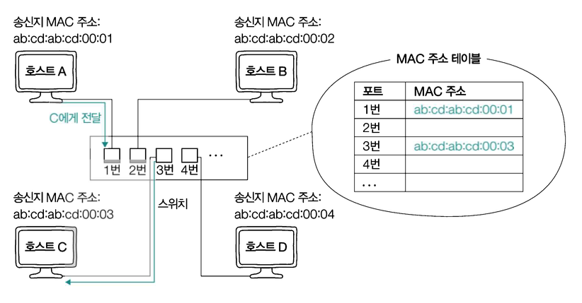
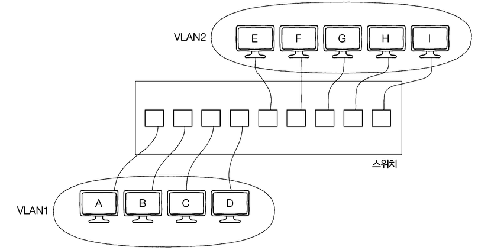

# 네트워크 인터페이스: NIC

- `네트워크 상에서 노드와 통신 매체가 연결되는 지점`을 `네트워크 인터페이스`라고 한다.
- **네트워크 인터페이스마다 물리적 주소라고 불리는** `MAC 주소`가 부여되고 `NIC(Network Interface Card)` 라는 하드웨어가 네트워크 인터페이스의 역할을 담당하는 것이 일반적이다.
- **통신 매체의 신호를 호스트가 이해하는 프레임으로 변환하거나, 호스트가 이해하는 프레임을 통신 매체의 신호로 변환하는 역할**을 수행한다.
- `NIC를 작동시키는 System Call`이 호출되면 **커널 모드로 전환된 뒤에 송수신**이 수행되고, **입출력이 완료되면 인터럽트를 통해 CPU에게 작업이 완료되었음을 알린다.**

# 허브와 스위치

> [!TIP]
>
> - 허브와 스위치는 물리 계층과 데이터 링크 계층의 중간 노드이다.
> - 허브는 오늘날 네트워크에서 잘 사용하지 않고 스위치를 사용하는 경우가 많다.

## 물리 계층의 허브

- `여러 대의 호스트를 연결하는 장치`로 `리피터 허브`라고도 부르고, `이더넷 네트워크의 허브`는 `이더넷 허브`라고도 부른다.
- **전달받은 신호를 모든 포트로 내보낸다.**
- `반이중 모드`로 송수신을 진행한다.
  - `반이중(Half Duplex)`: 송신 또는 수신을 번갈아 가면서 수행해야 하는 통신 방식 (즉, 동시 송수신이 불가능한 상태를 말한다)
  - 참고로 `전이중(Full Duplex)` 모드는 **동시 송수신이 가능한 상태를 말하고, `L2 계층의 네트워크 장비인 스위치`는 해당 모드를 지원**한다.

## 데이터 링크 계층의 스위치

> [!TIP]
>
> - **허브의 한계를 보완하기 위한 네트워크 장비**로, **전달받은 신호를 목적지 호스트가 연결된 포트로만 내보내고, 전이중 모드를 지원하기 때문에 Collision Domain의 범위가 좁다.**
> - `L2 스위치`라고도 많이 부른다.

### MAC 주소 학습

- 스위치가 전달받은 신호를 원하는 포트에만 내보낼 수 있는 이유는 `MAC 주소 학습` 때문이다.
  - **현재 어떤 포트에 어떤 MAC 주소를 가진 호스트가 연결되어 있어!**
  - `MAC 주소 테이블`: `포트, 연결된 호스트의 MAC 주소의 대응 관계`를 테이블 형태로 메모리에 저장하는 구조

### VLAN(Virtual LAN)

- **같은 스위치에 연결된 모든 호스트를 하나의 네트워크로 간주하고 싶지 않을 때, 여러 논리적인 네트워크로 나누고 싶을 때 사용한다.**
- **같은 스위치에 호스트 A부터 호스트 I까지 연결이 되어 있는데, 서로 다른 VLAN에 속해있기 때문에 서로 다른 네트워크로 간주되고, 브로드캐스트 도메인도 겹치지 않기 때문에 VLAN1의 브로드캐스트 메시지가 VLAN2에 도달하지 않는다.**
- 서로 통신을 주고받기 위해서는 네트워크 계층 이상의 장비가 필요하다.
