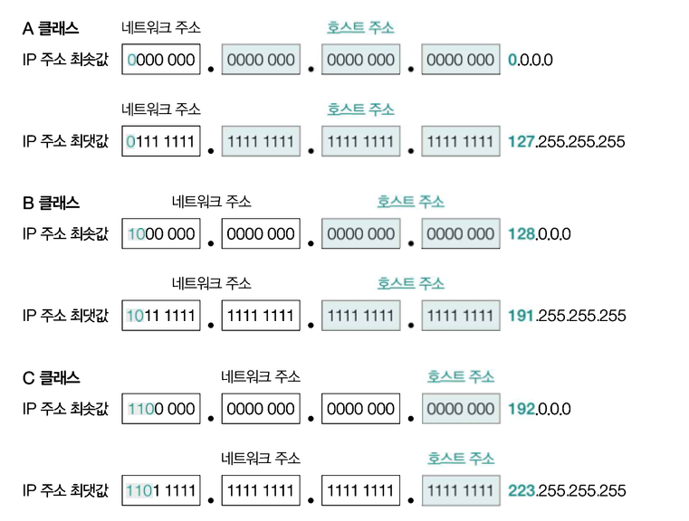

# IP 주소(IP Address)

## IP 주소의 구조

- 크게 `네트워크 주소`와 `호스트 주소`로 구성되어 있다.
- `네트워크 주소`는 `호스트가 속한 네트워크를 특정`하기 위해, `호스트 주소`는 `특정 네트워크에 속한 호스트를 특정`하기 위해 사용된다.
- 참고로, 하나의 IP주소에서 네트워크 주소를 표현하는 크기와 호스트를 표현하는 크기가 유동적일 수 있다.
  - 예를 들어, 192.168.0.1 이라는 IP주소가 있을 때, 네트워크 주소는 192.168.0, 호스트 주소는 1 이라고 표현할 수 있다.
  - 또는, 10.0.0.1 이라는 IP주소가 있을 때, 네트워크 주소는 10, 호스트 주소는 0.0.1 이라고 표현할 수 있다.

### 클래스풀 주소 체계 (Classful Addressing)

> [!NOTE]
>
> - IP주소에서 네트워크 주소와 호스트 주소를 구분하는 범위가 유동적일 수 있다고 했는데, 그러면 네트워크 주소와 호스트 주소의 크기는 어느정도가 적당할까?
> - 답은 상황에 따라 다르다는 것이다.
> - 호스트 주소의 공간을 너무 크게 할당하면 호스트가 할당되지 않은 다수의 IP주소가 낭비될 수 있고, 반대로 부족할 수도 있다.
> - 이러한 고민을 해결하기 위해 클래스 개념이 도입되었다.



- 클래스는 A~E까지 총 5개의 클래스로 구성되어 있지만, D와 E는 각각 멀티캐스트, 특수한 목적을 위해 예약된 클래스이다.

### 클래스리스 주소 체계 (Classless Addressing)와 서브넷 마스크 그리고 CIDR

> - 클래스풀 방식은 네트워크 크기가 고정되어 있어 다른 크기의 네트워크를 구성할 수 없어서 IP 주소가 낭비될 수 있다는 한계가 있었다.
> - 이러한 문제를 해결하기 위해 유동적으로 네트워크 영역을 나누기 위해 클래스리스 주소 체계를 사용한다.

- 클래스리스 주소 체계에서는 네트워크와 호스트를 구분하는 수단으로 `서브넷 마스크(Subnet Mask)`를 사용한다.
- `서브넷 마스크`: IP주소 상에서 네트워크 주소를 1로 표기하고, 호스트 주소를 0으로 표기한 비트열 (서브넷을 구분하는 비트열)
  - `A클래스`: 255.0.0.0
  - `B클래스`: 255.255.0.0
  - `C클래스`: 255.255.255.0
- `서브넷`: IP주소에서 네트워크 주소로 구분할 수 있는 네트워크의 부분 집합
- `서브네팅`: 서브넷 마스크를 이용해서 원하는 크기로 클래스를 더 잘게 쪼개어 사용하는 것

- `CIDR(Classless Inter-Domain Routing notation)`: `IP주소/서브넷 마스크상의 1의 개수` 로 표시하는 방법
  - ex. 192.168.1.100/24

### 서브네팅

> - 하나의 큰 네트워크 주소 공간을 더 작은 여러 개의 네트워크인 서브넷으로 나누는 과정을 의미한다.
> - 이를 통해 IP주소를 절약하고 보안 및 관리를 할 수 있다.

- `192.168,1.0/24` 라는 네트워크를 2개의 서브넷으로 나누고 싶다면?
  - 기존 마스크에서 마지막 옥텟의 첫 번째 비트를 빌림
  - `/25 (255.255.255.128)`
- 그 결과 `192.168.1.0 ~ 127`, `192.168.1.128 ~ 255` 2개의 서브넷으로 나뉘게 되었다.

### 네트워크/브로드캐스트 주소와 예약 주소

> 호스트 주소 범위 내에서 실제로 개별 장치에 할당할 수 없는 주소들이 있다.

- `네트워크 주소`: 호스트 주소의 비트가 모두 0인 주소는 그룹 전체를 대표하는 이름표로 쓰인다.
- `브로드캐스트 주소`: 호스트 주소가 모두 1인 주소는 해당 네트워크에 속한 모든 장치에게 동시에 데이터를 보낼 때 사용한다.
- `루프백 주소`: 127.0.0.1로 고정되어 있고, 자기 자신을 가리킨다.
- `0.0.0.0`: 아직 IP를 할당받지 못했거나 모든 네트워크를 의미하는 기본값으로 사용된다.
- `사설 네트워크 주소`: (개별 장치 할당 가능) NAT 기술을 통해 공유기로부터 할당받은 사설 네트워크 주소

### 공인 IP와 사설 IP

> - 맥에서 `ifconfig` 명령어로 확인한 IP주소와 인터넷에서 검색한 IP주소와 다를 것이다.
> - 그 이유가 뭘까?

- `공인 IP주소`: 고유한 IP주소이며, 네트워크 간 통신에서 사용되는 IP주소 (인터넷 검색), ISP로 부터 할당받을 수 있음
- `사설 IP주소`: 사설 네트워크에서 사용하기 위한 IP주소, 일반적으로 공유기를 통해 할당됨, 사전에 약속된 주소가 있음
  - 외부 인터넷에서는 해당 주소로 직접 접근할 수 없어서 공유기(NAT)를 거쳐야만 밖으로 나갈 수 있다.

```
[ 사설 IP 대역 예시 ]

- Class A: 10.0.0.0 ~ 10.255.255.255
- Class B: 172.16.0.0 ~ 172.31.255.255
- Class C: 192.168.0.0 ~ 192.168.255.255
```
