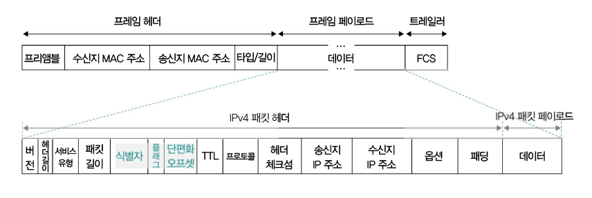

# IP (Internet Protocol)

> [!IMPORTANT]
>
> - IP의 본래 목적은 `주소 지정`과 `단편화`를 위한 프로토콜이다.
> - `주소 지정`: 네트워크 간의 통신 과정에서 호스트를 특정하는 것.
> - `단편화`: 데이터를 여러 IP 패킷으로 올바르게 쪼개어 보내는 것.
> - 또한, IP는 `신뢰할 수 없는 통신과 비연결성 통신` 이라는 특징이 있다.

## 라우터(Router)

- 서로 다른 네트워크에 속한 두 호스트가 네트워크 간 통신을 수행할 때 IP 주소를 바탕으로 목적지까지 IP Packet을 전달하는 네트워크 장비이다.
- L3 계층에 속한 네트워크 장비로, 전달받은 패킷을 목적지까지 전달하는 역할을 수행.
- `라우팅(Routing)`: 라우터는 IP 패킷을 전달할 최적의 경로를 결정하고 해당 경로로 패킷을 내보내는 것.
- **정리하자면, IP 주소를 기반으로 패킷의 최적 경로를 결정해서 목적지까지 전달하는 네트워크 장비이고, 대표적으로는 공유기도 라우팅을 수행할 수 있습니다.**

## MTU(Maximum Transmission Unit)

- **최대 전송 단위**
- **전송하고자 하는 IP Packet의 크기가 MTU라는 단위보다 클 경우에는 패킷을 MTU 이하의 여러 패킷으로 쪼개서 전송하고, 이렇게 쪼개서 전송된 패킷들은 수신지에서 조합됨.**
- 일반적인 MTU의 크기는 `1500 바이트`이다.
- `MTU`는 `프레임을 통해 주고받을 수 있는 최대 페이로드의 크기`

### 경로 MTU

오늘날의 네트워크 환경에서는 IP 단편화가 잘 발생하지 않는다. 단편화가 필요하지 않을 만큼 네트워크 성능이 발전하기도 했고, 무엇보다 IP 단편화가 발생하게 되면 악영향을 미치기 때문에 되도록이면 발생하지 않는 것이 좋다.

단편화된 패킷들이 많아지면 전송해야 할 패킷의 헤더들이 많아지기 때문에 불필요한 트래픽 증가와 대역폭 낭비를 초래하고 단편화된 패킷을 재조립하는 과정에서 발생하는 부하도 성능 저하로 이어질 수 있다.

IP 단편화를 피하려면 IP 패킷을 주고받는 경로에 존재하는 모든 호스트의 처리 가능한 MTU 크기를 고려해야 한다. 
즉, IP 단편화 없이 주고받을 수 있는 최대 크기만큼 전송해야 하는데 이 크기를 `경로 MTU` 라고 한다.

## IPv4 Packet Header 구조

- `식별자`: 특정 패킷이 어떤 데이터에서 쪼개진 패킷인지를 식별하기 위해 사용되는 필드
- `플래그`: 3비트로 구성된 필드. 첫 비트를 제외한 나머지 2개의 비트는 각각 DF와 MF라는 이름이 붙어 있음.
  - `DF(Don't Fragment)`: IP 단편화를 수행하지 말라
  - `MF(More Fragment)`: 단편화된 패킷이 더 있다
- `단편화 오프셋`: 특정 패킷이 초기 데이터에서 얼마나 떨어져 있는지가 명시된 필드
