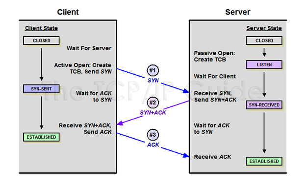
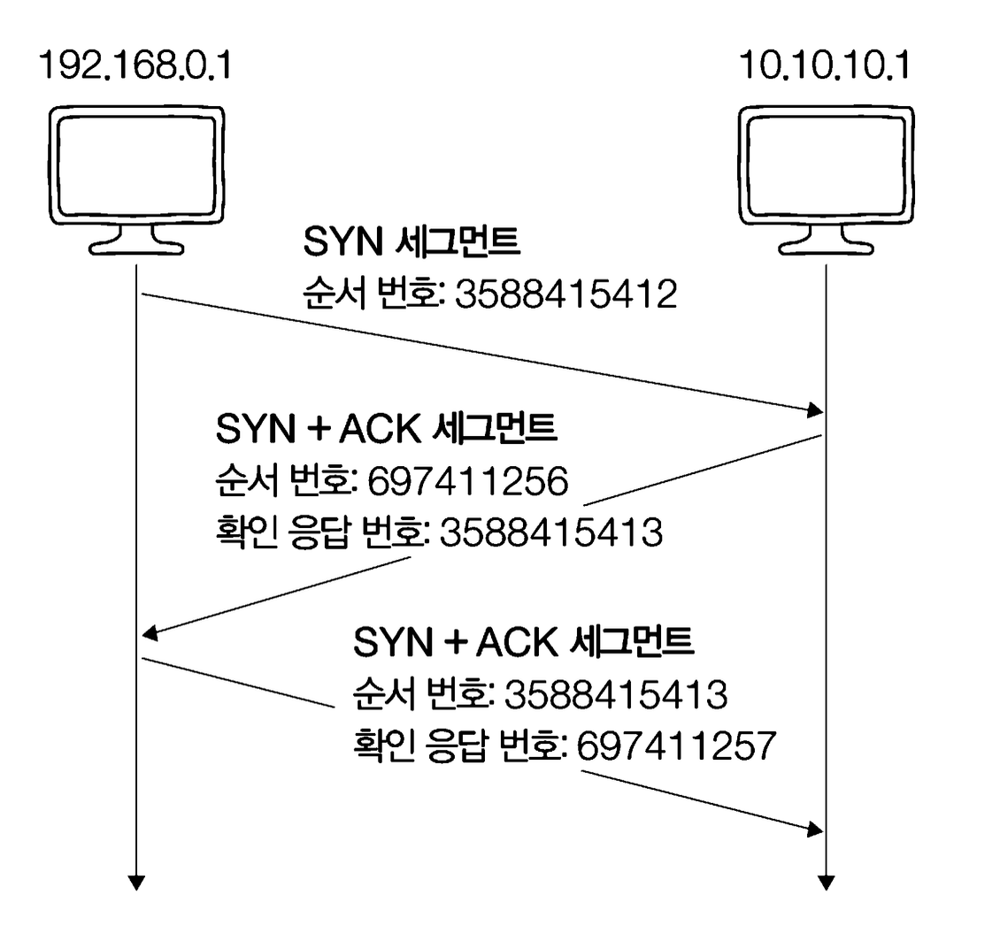

# 연결 수립: TCP 3-way Handshake



> - 양쪽 모두 데이터를 전송할 준비가 되었다는 것을 보장하고, 실제로 데이터 전달이 시작하기 전에 한쪽이 다른 쪽이 준비되었다는 것을 알 수 있도록 한다.

## Client -> Server: SYN

```
- 송신 호스트: 192.168.0.1 / 수신 호스트: 10.10.10.1
- 송신지 포트 번호: 49859(동적) / 수신지 포트 번호: 80(웰노운 포트)
- 송신 호스트의 클라이언트 프로세스가 임의의 동적 포트번호를 OS로 부터 할당받아서 HTTP 서버로서 동작하는 수신 호스트에게 연결 요청을 보낸 상황

순서번호: 3588415412
SYN 비트 1로 설정
```

- Client는 SYN 비트가 1로 설정된 세그먼트를 Server에게 전송한다.
- 이 때 세그먼트의 순서 번호에는 Client의 순서 번호가 포함되어 있다.

## Server -> Client: SYN + ACK

```
- 수신 호스트의 프로세스가 송신 호스트의 프로세스에게 세그먼트 전송

수신 호스트의 순서번호: 697411256
ACK 번호: 3588415413
SYN, ACK 비트 모두 1로 설정
```

- 첫 단계에 대한 Server의 응답이다.
- 서버는 ACK 비트와 SYN 비트가 1로 설정된 세그먼트를 클라이언트에게 전송한다.
- 순서 번호에는 서버의 순서 번호와 첫 단계에서 보낸 세그먼트에 대한 ACK 번호가 포함되어 있다.

## Client -> Server: ACK

```
순서번호: 3588415413
ACK 번호: 697411257
ACK 비트 1로 설정
```



- 클라이언트는 ACK 비트가 1로 설정된 세그먼트를 서버에 전송한다.
- 순서번호에는 클라이언트의 순서번호와 2단계에서 보낸 세그먼트에 대한 ACK 번호가 포함된다.

> - SYN 비트는 연결을 수립하기 위한 비트
> - 액티브 오픈: 처음 연결을 시작하는 과정 / 패시브 오픈: 연결 요청을 수신한 뒤 그에 대한 연결을 수립하는 과정
