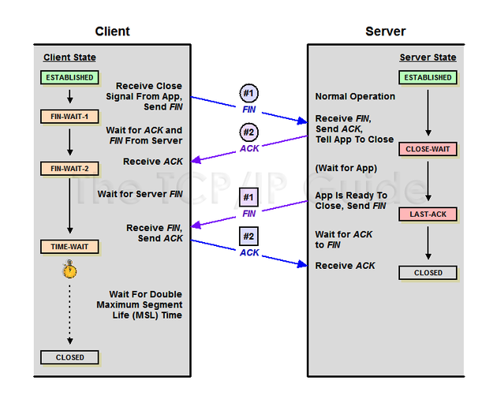

# 연결 종료: 4-way handshake

## Client -> Server: FIN

- 클라이언트는 FIN 비트가 1로 설정된 FIN 세그먼트를 서버에 전송
- 클라이언트 쪽에서 연결을 종료하겠다는 의미

## Server -> Client: ACK

- 1단계에 대한 응답으로 서버에서 ACK 세그먼트를 클라이언트에게 전송
- 서버는 일단 알았다는 응답을 하고 자신의 통신이 끝날때까지 기다림 -> 이것도 `TIME_WAIT`

## Server -> Client: FIN

- 서버에서 통신이 끝나서 연결이 종료되었다는 의미로 FIN 세그먼트를 클라이언트에게 전송함

## Client -> Server: ACK

- 3단계에 대한 클라이언트의 응답으로 ACK 세그먼트를 서버에 보냄

---

## TIME_WAIT 단계가 있는 이유?

> - 네트워크 혼잡이나 경로 재설정 등으로 인해서 패킷이 전송 순서대로 도착하지 않고 뒤늦게 도착하는 경우가 있습니다.
> - 만약 연결이 종료되자마자 동일한 IP와 포트 번호로 새로운 연결이 생성되었는데, 이전 연결에서 떠돌던 지연 패킷이 뒤늦게 도착한다면?
> - 또는 클라이언트가 보낸 마지막 ACK가 네트워크 문제로 서버에 도착하지 못하고 유실되었는데, 클라이언트가 바로 연결을 닫아버리면 서버는 여전히 클라이언트의 확인을 기다리게 되는데?

- TCP에서는 TIME_WAIT 상태를 유지하면서 해당 포트를 잠시 점유한다. 이 기간 동안 도착하는 이전 연결의 패킷들은 모두 폐기되면서 새로운 연결이 이전 데이터와 혼선되는 일을 방지할 수 있다.
- 또한, 서버는 ACK을 받지 못하면 FIN을 다시 보낸다. 클라이언트가 TIME_WAIT 상태라면 이 재전송된 FIN을 받아서 다시 ACK을 보낼 수 있게 되면서 정상적인 연결 종료가 가능해진다.

---

> - 액티브 클로즈: 먼저 연결을 종료하는 동작 / 패시브 클로즈: 연결 종료 요청을 받아들이는 동작
