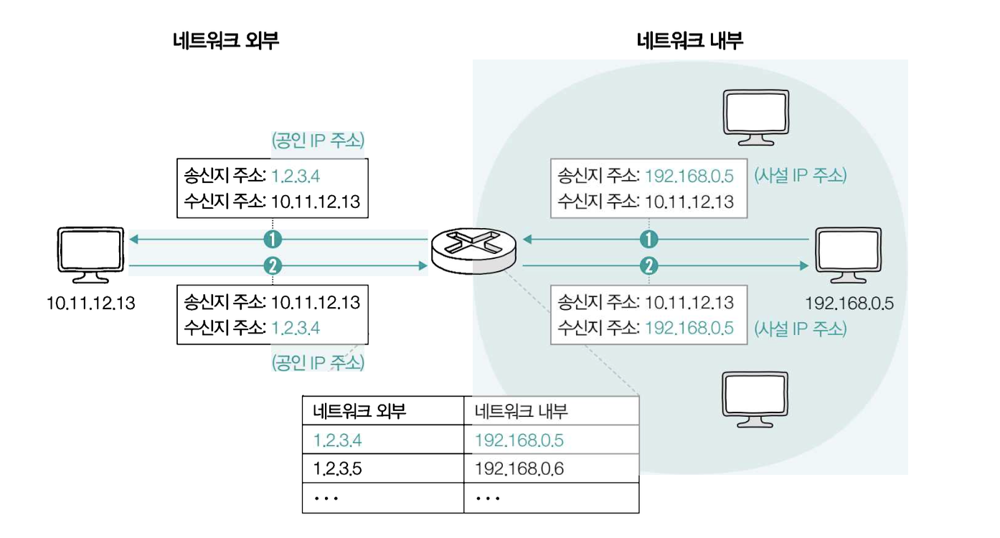
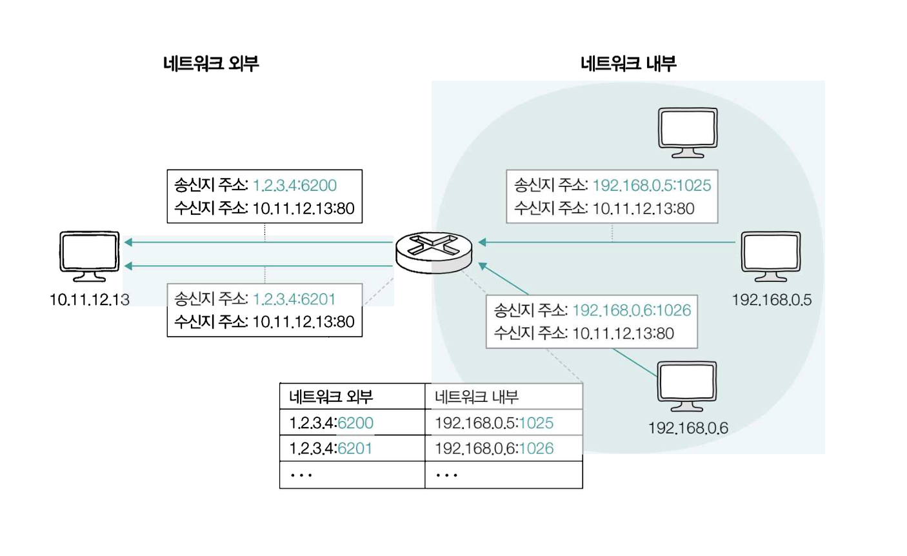

# NAT(Network Address Translation)와 NAPT(Network Address Port Translation)

## NAT(Network Address Translation)

> - 네트워크 외부에서 주로 사용되는 공인 IP주소와 네트워크 내부에서 주로 사용되는 사설 IP주소가 있다.
> - 네트워크 내부에서 사설 IP주소를 사용하는 호스트가 네트워크 외부에 있는 호스트와 패킷을 주고받기 위해서는 공인 IP주소와 사설 IP주소 간 변환이 필요하다.
> - 이 때 사용하는 기술이 NAT이다.

- **대부분의 라우터와 가정용 공유기는 NAT 기능을 내장하고 있다.**
- 사설 네트워크에서 공인 네트워크로 패킷을 전송하는 과정은 1번 과정을 거치고, 반대로 공인에서 사설로 패킷이 전송될 때는 2번 과정을 거친다.
- 그림에서는 네트워크 내부에 있는 사설 IP주소 1개는 하나의 공인 IP주소 하나로 일대일 대응되어 변환된다. 그런데 이렇게 되면 많은 주소가 필요할 수 밖에 없다.
- **그래서 오늘날 대중적으로 활용되고 있는 NAT는 변환하고자 하는 IP주소를 일대일로 대응하지 않고, 다수의 사설 IP주소를 하나의 공인 IP주소로 변환한다.**

## NAPT(Network Address Port Translation)

> [!NOTE]
>
> - 위에서 오늘날 대중적으로 활용되고 있는 NAT는 변환하고자 하는 IP주소를 일대일로 대응하지 않고, 다수의 사설 IP주소를 하나의 공인 IP주소로 변환한다. 라고 했다.
> - 이게 어떻게 가능한걸까?

- **서로 다른 사설 IP주소가 같은 공인 IP주소로 변환되더라도 포트 번호가 다르다면 네트워크 내부의 호스트를 특정할 수 있다.**
- **이처럼 IP 주소 변환 과정에서 변환할 IP 주소의 쌍과 더불어 포트 번호도 함께 고려하는 포트 기반의 NAT를 `NAPT(Network Address Port Translation)`라고 한다.**
