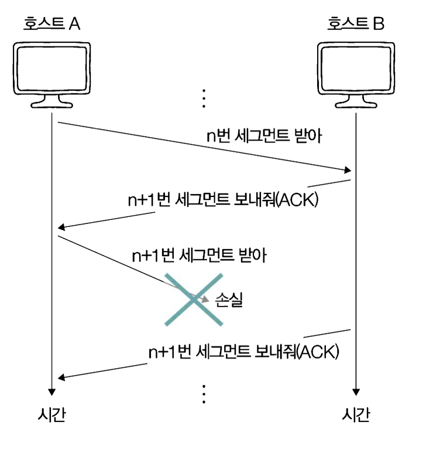
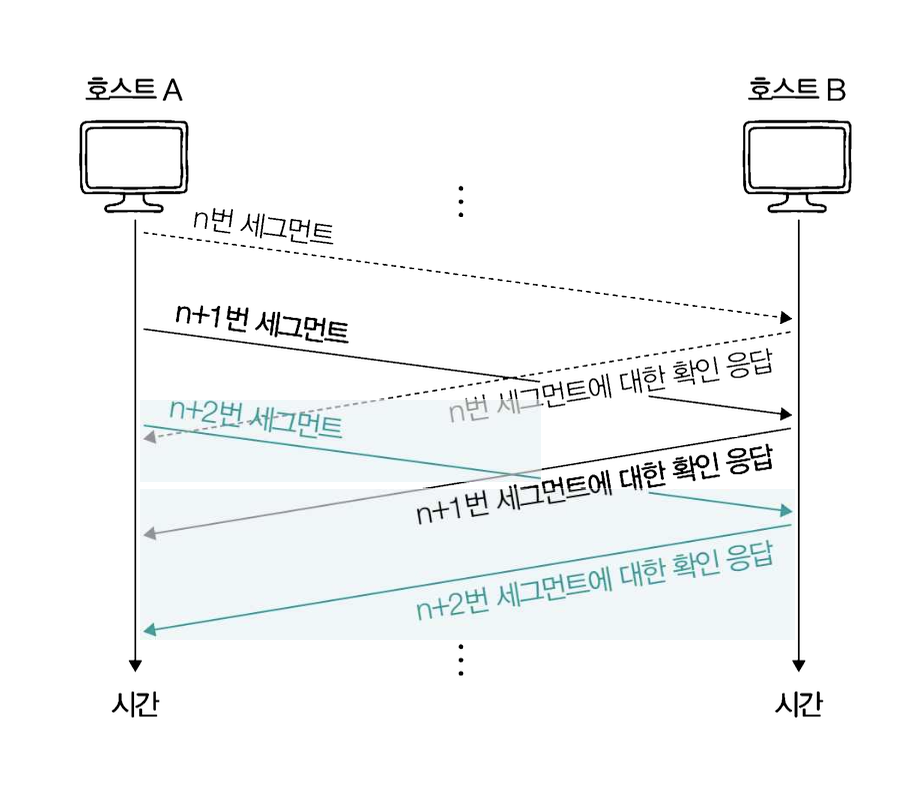

# TCP의 오류, 흐름 및 혼잡 제어

> - TCP는 송수신하는 패킷의 신뢰성을 보장하기 위해 오류 제어, 흐름 제어 그리고 혼잡 제어를 제공한다.
> - 재전송을 기반으로 다양한 오류를 제어하고, 송수신의 흐름을 제어해서 처리할 수 있을 만큼의 데이터만을 주고받고, 혼잡 제어를 통해 네트워크의 혼잡 정도에 따라 데이터의 전송량을 조절함.

## 재전송을 통한 오류 제어 (Error Control)

- 송수신 과정에서 잘못 전송된 세그먼트가 있는 경우, 이를 재전송해서 오류를 제어한다.
- 언제 잘못 전송된 세그먼트가 있음을 인지하는가?
  - `Duplicated-ACK`
  - `Timeout`

### 중복된 ACK 세그먼트를 수신한 상황

- 송신한 세그먼트 일부가 전송 중에 유실되어서 중복으로 ACK 세그먼트를 수신하게 되는 상황

### Timeout이 발생한 상황

- TCP 세그먼트를 송신하는 호스트는 모두 `재전송 타이머` 라는 특별한 값을 유지하는데, 호스트는 세그먼트를 전송할 때마다 재전송 타이머를 시작한다.
- **타이머의 카운트다운이 끝나는 상황을 타임아웃이라고 하며, 타임아웃 발생시점까지 ACK을 받지 못하면 세그먼트 전송 과정에 문제가 발생했다고 간주해서 세그먼트를 재전송한다.**

### 파이프라이닝 전송

전통적인 `Stop-and-Wait` 방식은 송신 측이 패킷을 하나 보낸 후, 수신 측으로부터 ACK이 도착할 때까지 네트워크 통로가 비어있게 되는데, 이 대기 시간 동안 전송 자원이 낭비되는 것을 방지하고, BandWidth를 최대한 활용하기 위해 파이프라이닝이 사용되는 것이다.

**즉, 데이터 전송의 효율성을 높이기 위해 사용되는 기법으로 송신 측이 이전 패킷에 대한 확인 응답을 받기 전에 여러 개의 패킷을 연속적으로 전송하는 방식이다.**

## 흐름 제어 (Flow Control)

- 수신 호스트가 한번에 n개의 바이트를 받아서 처리할 수 있다면 송신 호스트에서는 n 이상을 보낼 수 있어도 n 바이트를 넘지 않는 선에서 송신해야 한다.
- 즉, 송신 측과 수신 측 사이의 속도 차이를 조절하는 것이다. 수신 측의 버퍼가 꽉 차서 데이터를 처리못하는 OverFlow 현상을 방지한다.
- 참고로, 수신 호스트가 한 번에 받을 수 있는 전송량은 TCP 수신 버퍼의 크기에 의해 결정된다. 수신 버퍼는 수신된 세그먼트가 애플리케이션 프로세스에 의해 읽히기 전까지 임시 저장되는 공간으로, 커널에 정의되어 있다.

그렇다면 송신쪽에서는 수신쪽이 한번에 처리할 수 있는 양을 어떻게 알고 보내줄 수 있을까? 
TCP 헤더의 Window Size 필드가 있는데, 해당 필드에는 수신 호스트가 한번에 처리할 수 있는 `수신 윈도우` 크기가 명시된다. 
수신 측에서는 윈도우 필드를 통해 송신 호스트에게 한 번에 처리 가능한 양을 알려주고, 송신 쪽에서는 이를 확인해서 조절해서 보낸다 (Sliding Window)

## 혼잡 제어 (Congestion Control)

- 네트워크 전체의 교통 체증을 조절하는 것
- 네트워크 통로가 감당할 수 없을 만큼 많은 데이터가 몰려 전송 속도가 급격하게 떨어지는 것을 방지
- 흐름 제어의 주체는 수신 호스트이며, 혼잡 제어의 주체는 송신 호스트이다.
- 중복된 ACK, 타임아웃이 발생했을 때 네트워크가 혼잡하다고 판단할 수 있다.
- 혼잡 없이 전송할 수 있을 정도의 양: `Congestion Window` (커널에 정의됨)
- 혼잡 윈도우의 크기는 `혼잡 제어 알고리즘`을 통해서 계산된다. (AIMD: Additive increase/multiplicative decrease)
  - AIMD: 합으로 증가, 곱으로 감소
  - 세그먼트를 보내고 그에 대한 응답이 오기까지 혼잡이 감지되지 않으면 혼잡 윈도우를 1씩 선형적으로 증가
  - 혼잡이 감지되면 혼잡 윈도우를 절반으로 떨어뜨리는 동작을 반복
- 패킷을 보내고 그에 대한 응답이 수신되기까지의 시간을 `RTT(Round-Trip Time)` 이라고 한다.
