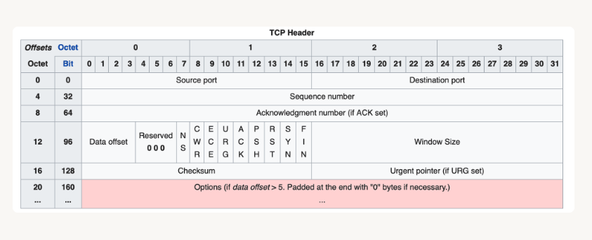

# TCP Header 구조

> [!NOTE]
>
> - [TCP의 헤더에는 어떤 정보들이 담겨있는걸까?](https://evan-moon.github.io/2019/11/10/header-of-tcp/)

## Source/Destination Port

> - 송수신지 포트 번호 (16비트)

## Sequence Number: 순서 번호

> - TCP Segment의 올바른 송수신 순서를 보장하기 위해 세그먼트 첫 바이트에 매겨진 번호.
> - 순서 번호를 통해서 현재 주고받는 TCP Segment가 송수신하고자 하는 데이터의 몇 번째 바이트에 해당하는지 알 수 있다.
> - 제어 비트에서 `SYN` 플래그가 1인 경우, 초기 순서번호(랜덤)이고, 그렇지 않은 경우에는 세그먼트의 순서 번호.

## ACK Number: 확인 응답 번호

> - 상대 호스트가 보낸 세그먼트에 대한 응답으로, 다음으로 수신하길 기대하는 순서 번호.
> - 연결 설정 및 해제 때 발생하는 과정에서는 일반적으로는 올바르게 수신한 순서 번호에 1이 더해진 값.
> - 실제로 데이터를 주고 받을 때는 `상대방이 보낸 시퀀스 번호 + 자신이 받은 데이터의 바이트 수`로 만들어짐.

## Data Offset: 전체 세그먼트 중에서 헤더가 아닌 데이터가 시작되는 위치 표기

> - 32비트 워드 단위 체계 (1워드 = 4바이트)
> - 해당 필드의 값에 4를 곱하면 세그먼트에서 헤더를 제외한 실제 데이터의 시작 위치를 알 수 있음.
> - 해당 필드에 할당된 4비트로 표현할 수 있는 값은 0-15 워드이기 때문에 기본적으로 0-60 바이트의 오프셋까지 표현할 수 있다.
> - 하지만, 옵션 필드를 제외한 나머지 필드는 필수로 존재해야 하기 때문에 최소 값은 20바이트(5워드)로 고정되어 있다.
> - 해당 필드가 필요한 이유는 옵션 필드의 길이가 고정되어 있지 않고 유연하기 때문이다.

## Reversed: 예약된 필드

## Flag(Control Bits): 제어 비트(현재 세그먼트의 속성)

### 기존 플래그

> - `URG(Urgent Pointer)`: 긴급 포인터 존재 여부. 해당 포인터가 가리키는 긴급한 데이터는 우선 처리됨.
> - `ACK(Acknowledgment Number)`: ACK 필드에 값이 채워져있음을 알리는 플래그. 해당 플래그가 0이라면 ACK 필드 자체가 무시된다.
> - `PSH(Push)`: 해당 데이터를 최대한 빠르게 응용프로그램에게 전달해달라는 플래그.
>   - 0이라면 수신 측은 자신의 버퍼가 다 채워질 때까지 기다림.
>   - 1이라면 특정 세그먼트 이후에 더 이상 연결된 세그먼트가 없음을 의미함.
> - `RST(Reset)`: 이미 연결이 확립되어 `ESTABLISHED` 상태인 상대방에게 연결을 강제로 리셋해달라는 요청의 의미.
> - `SYN(Synchronize)`: 상대방과 연결을 생성할 때, 시퀀스 번호의 동기화를 맞추기 위한 세그먼트.
> - `FIN(Finish)`: 상대방과의 연결을 종료하고 싶다는 요청 세그먼트.

### 신규 플래그

- 기존의 Reversed 필드를 사용해서 새롭게 추가된 `NS`, `CWR`, `ECE` 플래그는 네트워크의 명시적 혼잡통보(ECN: Explicit Congestion Notification)를 위한 플래그이다.
- ECN을 사용하지 않던 기존의 넽워크 혼잡 상황 인지 방법은 타임아웃을 이용한 방법이었다. 하지만 처리 속도에 민감한 애플리케이션에서는 이런 대기 시간 조차 아깝기 때문에, 송수신자에게 네트워크 혼잡 상황을 명시적으로 알리기 위한 메커니즘이 ECN이다.
- 참고로, `CWR`, `ECE`, `ECT`, `CE` 플래그를 사용해서 상대방에게 혼잡 상태를 알려줄 수 있는데, 이 중 `CWR`, `ECE` 플래그는 TCP 헤더에, `ECT`, `CE` 플래그는 IP 헤더이 있다.

> - `NS`: ECN에서 사용하는 CWR, ECE 필드가 실수나 악의적으로 은폐되는 경우를 방어하기 위해 추가된 필드
> - `ECE(ECN Echo)`: 해당 플래그가 1이면서 SYN 플래그가 1일 때는 ECN을 사용한다고 상대방에게 알리는 의미. SYN 플래그가 0이라면 네트워크가 혼잡하기 때문에 세그먼트 윈도우 사이즈를 줄여달라는 요청.
> - `CWR`: 이미 ECE 플래그를 받아서 전송하는 세그먼트 윈도우 크기를 줄였다는 의미.

## Window Size: 한번에 전송할 수 있는 데이터의 양

## Checksum: 오류 검출을 위한 필드

> - TCP에서의 Checksum은 전송할 데이터를 16비트씩 나눠서 차례대로 더해가는 방법으로 생성한다.
> - 8bit로 가정하고 11010101 + 10110100 을 하게 되면 9bit가 되면서 자리올림(캐리: Carry)가 발생한다.
> - 자리올림이 생기면서 Checksum 필드에 담을 수 없게 되었음 -> 자리올림을 그대로 떼어내고 계산 결과에 더해준다.
>   - 10001001 + 1 -> 10001010
> - 이후 마지막 계산 결과에 1의 보수를 취해주면 Checksum이 된다 (10001010 -> 01110101)
> - 수신 측에서는 10001010 까지만 만든 다음에 송신측이 보낸 Checksum을 더해서 모두 11111111이 되면 데이터가 정상이라고 판단한다.

## Urgent Pointer: 긴급 포인터

> - 해당 플래그가 1이라면 수신측은 해당 포인터가 가리키고 있는 데이터를 우선 처리한다.

## Options: TCP의 기능을 확장할 때 사용하는 필드

> - 해당 필드는 가변적이다. 그리고 이 필드 때문에 수신 측이 어디까지가 헤더고 어디서부터 데이터인지 알기 위해 `Data Offset` 필드를 사용한다.
> - TCP 헤더는 기본 20바이트이지만, 옵션에 따라 최대 60바이트까지 늘어날 수 있다.
> - 데이터 오프셋 필드는 4비트로, 단위는 32비트 워드인 4바이트이다.
>   - 해당 값이 5라면 5 \* 4 = 20바이트이기 때문에 옵션이 없다.
>   - 해당 값이 15라면 15 \* 4 = 60바이트이기 때문에 최대 옵션이다.
