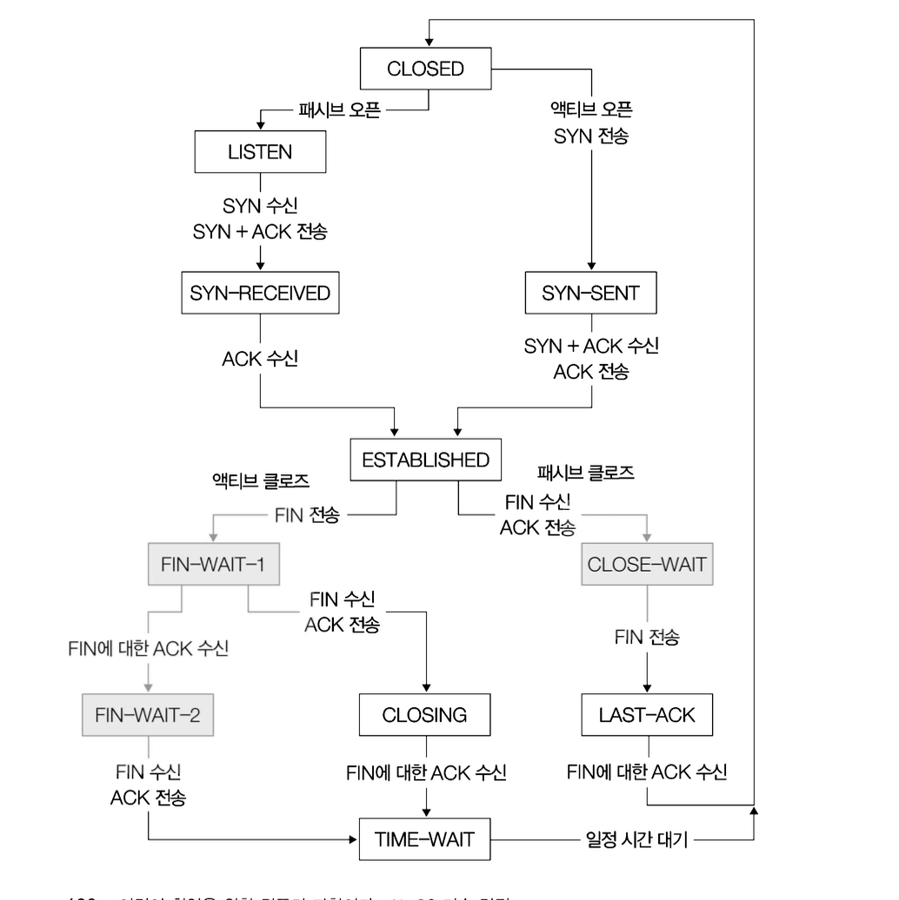
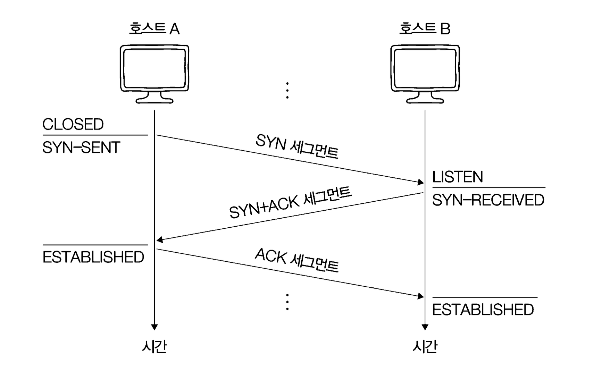
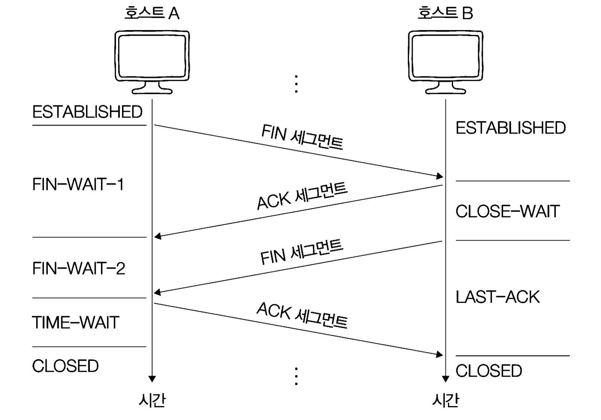

# TCP의 상태 관리

> - TCP는 상태를 유지하고 관리하는 프로토콜이라는 점에서 Stateful Protocol 이라고도 한다.

- 연결이 수립되지 않았을 때 주로 활용되는 상태
- 연결 수립 과정에서 주로 활용되는 상태
- 연결 종료 과정에서 주로 활용되는 상태

## 연결 수립되지 않았을 때: CLOSED, LISTEN

- `CLOSED`: 아무런 연결이 없는 상태
- `LISTEN`: 연결 대기 상태(3-way handshake의 첫 단계인 SYN 세그먼트를 기다리는 상태)

**참고로, 서버로서 동작하는 패시브 오픈 호스트는 일반적으로 항상 LISTEN 상태로써 연결 요청을 기다린다.**

## 연결 수립 과정: SYN-SENT, SYN-RECEIVED, ESTABLISHED

- `SYN-SENT`: 액티브 오픈 호스트가 SYN 세그먼트를 보낸 뒤, 그에 대한 응답은 SYN + ACK 세그먼트를 기다리는 상태
- `SYN-RECEIVED`: 패시브 오픈 호스트가 SYN + ACK 세그먼트를 보낸 뒤, 그에 대한 ACK 세그먼트를 기다리는 상태
- `ESTABLISHED`: 3-way handshake가 끝난 뒤 데이터를 송수신할 수 있는 상태

## 연결 종료 과정: FIN-WAIT-1, CLOSE-WAIT, FIN-WAIT-2, LAST-ACK, TIME-WAIT

- `FIN-WAIT-1`: 액티브 클로즈 호스트가 FIN 세그먼트로 연결 종료 요청을 보낸 상태
- `CLOSE-WAIT`: FIN 세그먼트를 받은 패시브 클로즈 호스트가 그에 대한 응답으로 ACK 세그먼트를 보낸 후 대기하는 상태
- `FIN-WAIT-2`: FIN-WAIT-1 상태에서 ACK을 받은 상태
- `LAST-ACK`: CLOSE-WAIT 상태에서 FIN 세그먼트를 전송한 뒤 대기하는 상태
- `TIME-WAIT`: 액티브 클로즈 호스트가 마지막 ACK 세그먼트를 전송한 뒤의 상태
  - 마지막 ACK 세그먼트가 올바르게 전송되지 않았을 수 있으며 이 경우 재전송이 필요하기 때문.
