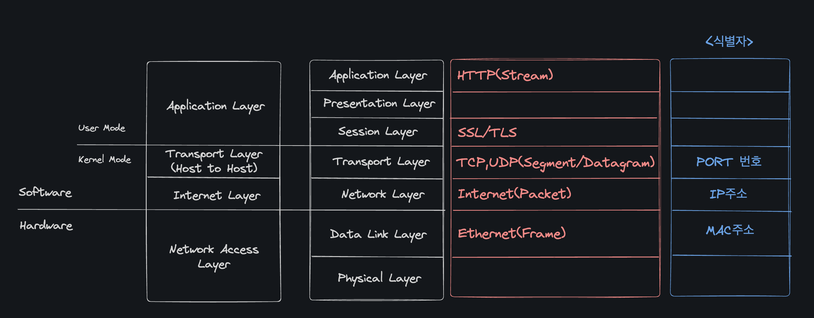

# OSI 7 Layer

## 물리 계층 (Physical Layer)

- 비트 신호를 주고받는 계층
- 0과 1로 이루어진 신호를 유무선 통신 매체를 통해 운반하는 계층

## 데이터 링크 계층 (Data Link Layer)

- **같은 LAN에 속한 호스트끼리 올바르게 정보를 주고받기 위한 계층**
- 같은 네트워크에 속한 호스트를 식별할 수 있는 주소인 `MAC 주소`를 사용한다.
- `MAC 주소`는 `NIC(Network Interface Card)`를 식별한다.

## 네트워크 계층 (Network Layer)

- **네트워크 간 통신을 가능하게 하는 계층. LAN을 넘어 다른 네트워크와 통신을 주고받기 위해 필요한 계층.**
- 네트워크 간 통신 과정에서 호스트를 식별할 수 있는 주소인 `IP 주소`가 필요하다.
- 대표적인 프로토콜로 `IP(Internet Protocol)`가 있다.

## 전송 계층 (Transport Layer)

- **네트워크를 통해 송수신되는 패킷은 전송 도중 유실될 때도 있고, 순서가 뒤바뀔 때도 있다.**
- 이러한 상황에 대비해서 신뢰성 있는 전송을 가능하게 하는 계층.
- `포트 번호`를 통해 특정 응용 프로그램과의 연결 다리 역할을 수행하는 계층.
  - 포트 번호는 `인터페이스(L2)` / `Service(L3)` / `Process(L4)` 로 불릴 수 있다.
- 대표적인 프로토콜로 `TCP와 UDP`가 있다.

## 세션 계층 (Session Layer)

- 응용 프로그램 간의 연결 상태를 의미하는 세션을 관리하기 위한 계층

## 표현 계층 (Presentation Layer)

- 인코딩, 압축, 암호화와 같은 작업을 수행하는 계층

## 응용 계층 (Application Layer)

- **사용자와 가장 밀접하게 맞닿아 있어 여러 네트워크 서비스를 제공하는 계층**
- 대표적인 프로토콜로 `HTTP`, `HTTPS`, `DNS` 등이 있다.
