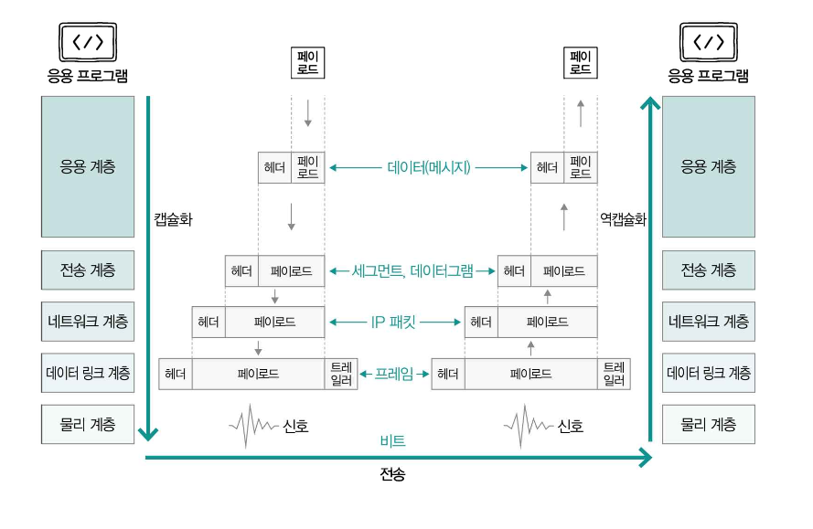

# 캡슐화(Encapsulation)와 역캡슐화(Decapsulation)

> [!IMPORTANT]
>
> - 패킷을 송신하는 쪽에서는 상위 계층에서 하위 계층으로 정보를 보내고, 패킷을 수신하는 쪽에서는 하위 계층에서 상위 계층으로 정보를 받아들임.
> - 각 계층에서는 어떤 정보를 송신할 때 상위 계층으로부터 내려받은 패킷을 Payload로 삼고, 각 계층에 포함된 프로토콜의 각기 다른 목적과 특징에 따라 Header 혹은 트레일러를 덧붙인 다음 하위 계층으로 전달함.

이처럼 `캡슐화`는 **송신 과정에서 헤더 및 트레일러를 추가해 나가는 과정**을 말하고, `역캡슐화`는 **캡슐화 과정에서 붙인 헤더 및 트레일러를 각 계층에서 확인한 뒤 제거하는 과정**을 의미한다.

- `응용 계층`: HTTP 프로토콜이면 HTTP 헤더
- `전송 계층`: TCP/UDP 헤더
- `네트워크 계층`: IP 헤더
- `데이터 링크 계층`: 프레임 헤더
